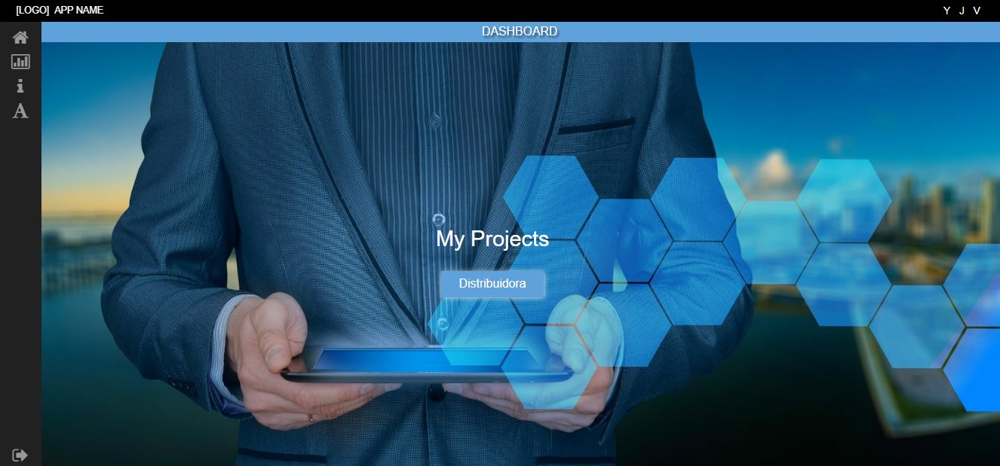
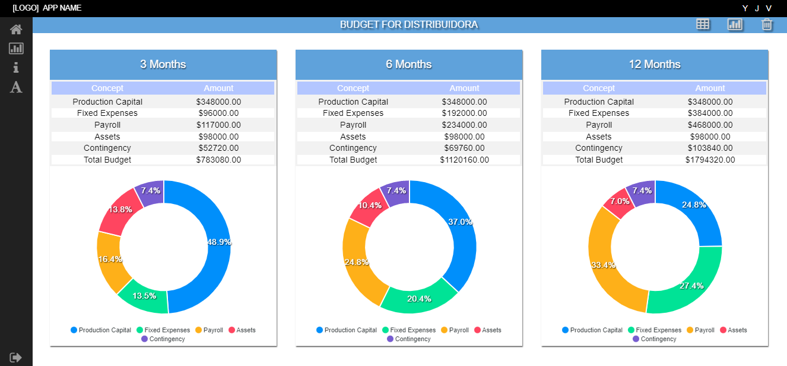
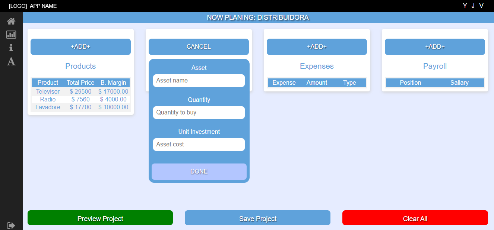

# EVA

# Business Projects Evaluator

- [x] ASP.NET CORE
- [x] SQL Server
- [x] REACT

Evaluaation tool to get projections and analize ciacility of bussiness ideas.
Yuo get all of your projects indicators like:

- [x] Project KPIs
- [x] Sales Projection
- [x] Budget.
- [x] Cost overview
- [x] Project Metrics
- [x] Income indicators

## start the app

    1- create a .env fallowing the envexample file structure
    2- run "npm install" on both /client and /backend folders to install dependencies
    4- run "npm start" in the client folder to start the front end

## Funtionality

